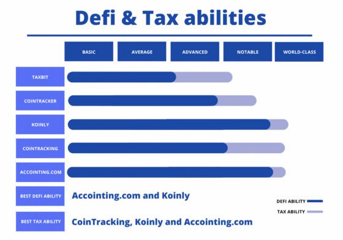
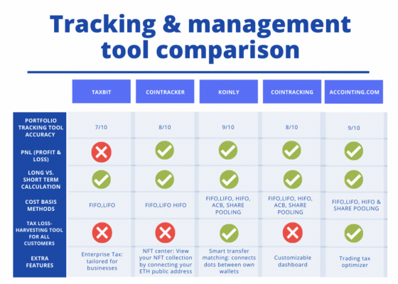

### FinTechBC-Homework-Unit1

# A Case Study on Cryptocate - A company specialising in Cryptocurrency Tax Reporting in Australia using web application CoinTracking.info

---

## Overview and Origin of Cryptocate and CoinTracking.info

* [Cryptocate](https://cryptocate.com.au/) (ABN: 40 655 697 127) was incorporated in 21/11/2017 with the following mission statement

> Cryptocate is an innovative blockchain education and advisory company proudly based in Adelaide, South Australia. We are dedicated to: development of the blockchain ecosystem in Australia, improvement of consumer protection surrounding digital assets with education, and support of business growth with innovative new business models.

* The company came about after the ATO began cracking down on cryptocurrency traders by obtaining data relating to cryptocurrency transactions from cryptocurrency designated service providers
(ATO2019). The ATO is using this data as part of their data matching protocol alongside Australian domiciled exchanges, to ensure all Australian’s are compliant by cryptocurrency tax regulation.

* The founders of the Cryptocate are:

1. [Calln Sarre](https://www.linkedin.com/in/callansarre/)
2. [Marc Phillis](https://www.linkedin.com/in/marc-phillis/)

* Cryptocate reports revenue of less than $5 Million, it is likely that the company is self funded.

> [CoinTracking.info](https://www.cointracking.info) is a web-based application that analyzes your trades and generates real-time reports on profit and loss, the value of your coins, realized and unrealized gains, reports for taxes and much more. 

* CoinTracking.info was founded in 2012 and went online in April 2013 as the world's first cryptocurrency tax reporting tool and portfolio manager. The company was started with the goal of making cryptocurrency traders’ lives easier - not only during tax season.

* The founder of the CoinTracking.info is:

1. [Dariusz Kachel](https://www.linkedin.com/in/dariusz-kachel/)

* CoinTracking.info reports revenue in $5-$10 Million. Funding status is Corporate backed or Merged/Acquired.

 [^1]

---

## Landscape:

* Cryptocate is one of many companies entering this fast moving space and are heavily involved with the burgeoning weight of bringing crypto enthusiasts and businesses alike into tax compliance in Australia.

* With the massive increase in the onboarding of new retail and business clients to the world of cryptocurrencies, being able to collate trading, transactional and long term investing data across many different exchanges and wallets has been a herculean task to say the least. Having tools that can access exchanges through APIs and pull together all these different data sources is a major step foward.

* With potential customers for tax compliance companies being scattered across vast distances using tools for online consultation is key. Cryptocate uses the Google suite of productivity tools. 

* The major Australian accounting companies in this domain are:
1. Goodwill Charted Accountants
2. WealthSafe
3. Tax On-Chain
4. KovaTax
5. FullStack
6. CryptoTax
7. Munro's Cryptocurrency Accountants
8. CryptoTaxAus
9. MHPrivate
10. Advanced Accounting and Advisory

* The major web application software companies in this domain are:
1. [ACCOINTING](https://www.acointing.com)
2. [CoinTracking.info](https://www.cointracking.info)
3. [Koinly](https://www.koinly.io)
4. [Cointracker](https://www.cointracker.io)
5. [CryptoTax Calculator](https://app.cryptotaxcalculator.io)

---

## Business Activities:

### Cryptocate
* Investors and retail cryptocurrency traders can get overwhelmed with the sheer number of data points they need to collect. Add to this the tax complexities of the new paradigm and we have a recipe for disaster. With this comes the panic of being non-compliant with the ATO, and without, in the foreseeable future, the ability to meet their tax obligations. Cryptocate, with the use of Cointracking software, was quick to meet the challenge that these Australian investors and retail traders faced.

* Furthermore Cryptocate is a cryptocurrency specialist, which means clients don’t have to change their accountant.

* SMSF - For those Australians choosing to manage their own retirement plans Cryptocate can help them report their cryptocurrency tax so that they stay compliant within the SMSF framework.

* Business - For businesses who receive payments in cryptocurrencies as part of their income Cryptocate is able to assist in managing this process with regards to ATO reporting and compliance.

* Accountants - Cryptocate can provide consultancy and guidance to other accountants relating to Australian cryptocurrency tax laws. 

* Cryptocate's tech stack include: [^2]
1. Python
2. Hubspot
3. Facebook Workplace
4. Litespeed Web Server
5. Cointracking.info 
6. Google Productivity Suite

### CoinTracking.info 
* CoinTracking.info started out as a cryptocurrency portfolio tracker app and with time, added the tax reporting features which made it far more popular and known in crypto circles. CoinTracking.info has accumulated over 1 million users. Its worldwide professional network consists of more than 160 tax advisors and tax lawyers to assist with international tax filing, as well as 1250 corporate clients such as crypto trading companies, fund managers and tax firms. 

* CoinTracking.info has superior data importing capabilities that can import data from the casual trader, to the most sophiticated of traders who have trades running into the hundreds of thousands.

* CoinTracking.info can populate cryptocurrency trading information automatically, it instantly fills a key niche. Instead of having to manually type in every single buy or sell order, CoinTracking.info users can simply import their trading data through exchange APIs or CSV files. The software will do the rest of the work.

* CoinTracking.info also brings together DeFi & Tax capabilities for calculating taxable events from staking, lending, yield farming, NFT's and other DeFi activities.

* With the high volatility in the cryptocurrency markets (6000 currencies, 300 exchanges) tracking and management becomes one of Cointracking.info's key strengths. Without this keeping track becomes tedious and eventually unmanageable.

* The target audience for CoinTracker.info are those interested in Investing, Banking Credit and Finance, with the largest demographic being the 25-34 year old age group.

* CoinTracking.info tech stack includes: [^3]
1. AT&T Internet
2. Google Font API
3. JQuery
4. Amazon CloudFront
5. PHP
6. NGINX

---

## Results:

* Cryptocate has had huge impact, bringing a sigh of relief as both retail and business customers are now able to be brought into tax compliance.

* Furthermore, Cryptocate has provided guidance to the space by being highly active in local associations, nurturing the community as a whole. 

* CoinTracking.info continues to maintain its market lead by providing a solid service however the competition is making ground on this lead.

* In terms of features CoinTracking.info is trailing ACCOINTING, however in terms of revenue ACCOINTING sits at $1-$2 Million, whereas CoinTracking.info generates $2-$5 Million.

**ACCOINTING metrics:** [^4]

Total Visits: 143.2K

Bounce Rate: 40.87%

Pages per Visit: 6.22

Avg Visit Duration: 00:05:43

**CoinTracking.info Metrics:** [^5]

Total Visits: 826.0K

Bounce Rate: 50.39%

Pages per Visit: 4.81

Avg Visit Duration: 00:07:09

---

## Recommendations:

* Cryptocate have kept their offerings very slick, this is reflected in their website. I couldn't add to what they are already doing.

* CoinTracking.info can improve their tax loss harvesting offering in their toolset. This would improve the customers ability to minimise the capital gains tax payable. To implement this capability CoinTracking.info would need to extend their software using the same tool stack they are already using, but just polish the required output from the information already in hand. Using the current technology stack would reduce reskilling, and implementation time.

* CoinTracking.info's website could do with a fresher look. This is reflected in the higher bounce rate shown above. One of the tools in the tech stack is PHP, I would recommend that it's time to move to a more modern tech stack possibly including Flutter for seamless code development across mobile platforms.

* Currently CoinTracking.info's competitors are doing a better job of this tax loss harvesting.

[^1]: [10 Best Crypto Tax Software](https://medium.com/coinmonks/best-crypto-tax-tool-for-my-money-72d4b430816b) 

[^2]: [zoominfo:Cryptocate](https://www.zoominfo.com/c/cryptocate/456329150)

[^3]: [zoominfo:CoinTracker.info](https://www.zoominfo.com/c/cointracking/468359451)

[^4]: [similarweb: ACCOINTING](https://www.similarweb.com/website/accointing.com/#overview)

[^5]: [similarweb: CoinTracking.info](https://www.similarweb.com/website/cointracking.info/#overview)